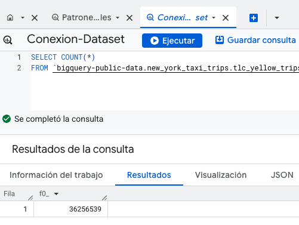
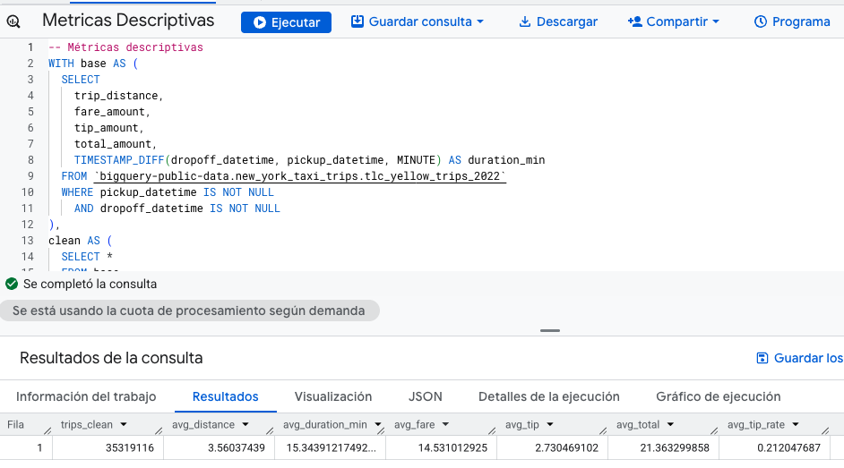
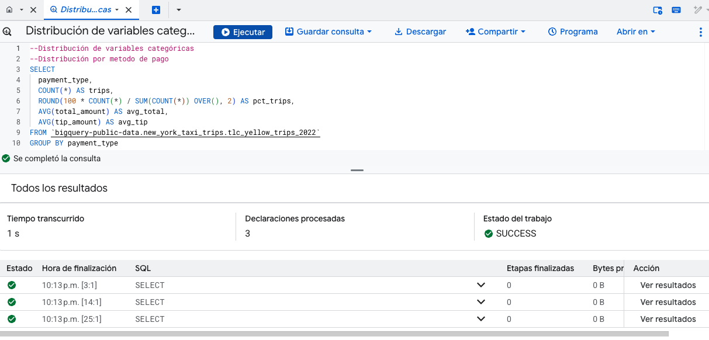
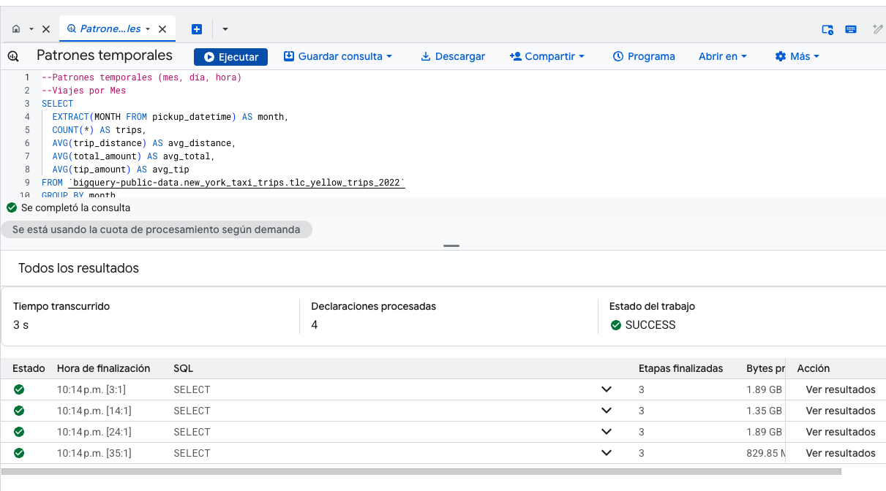
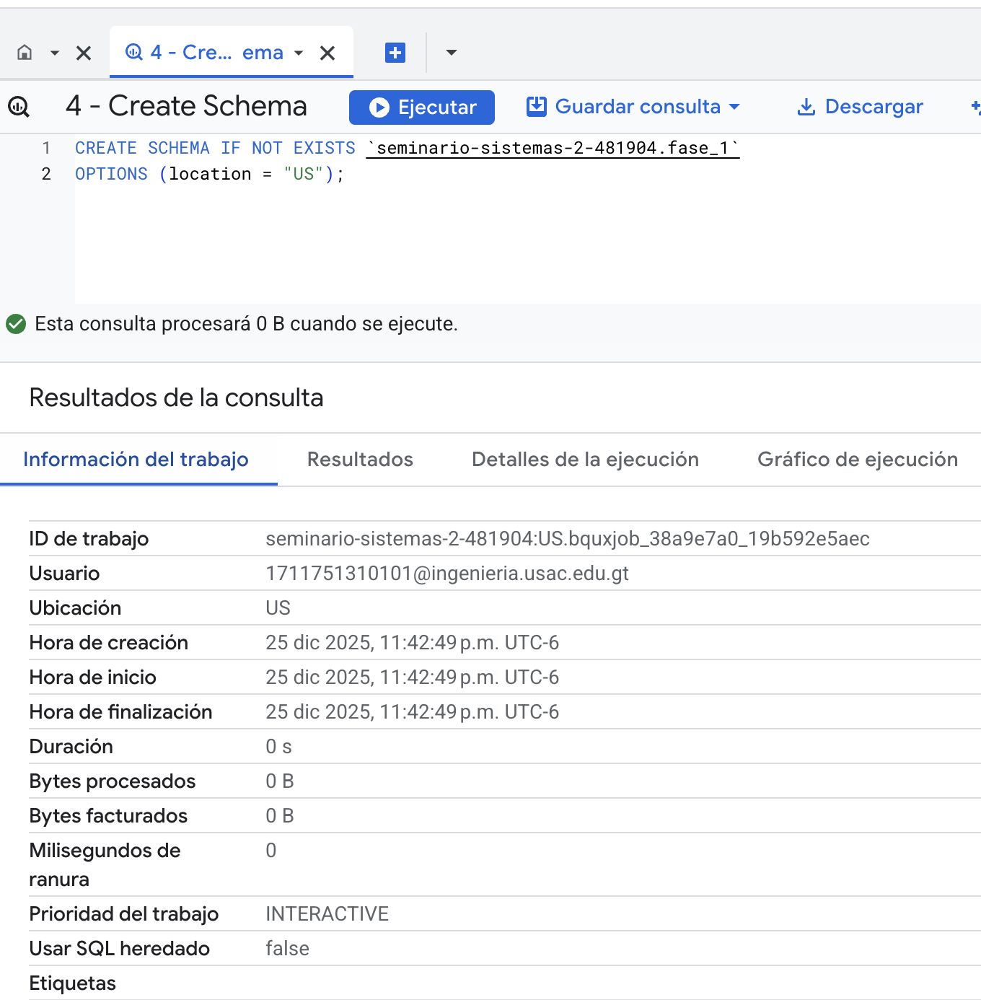
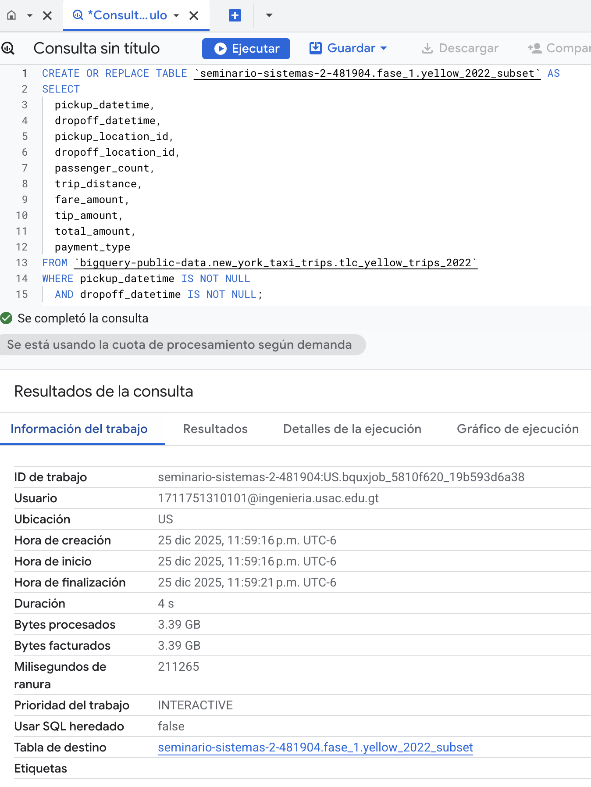
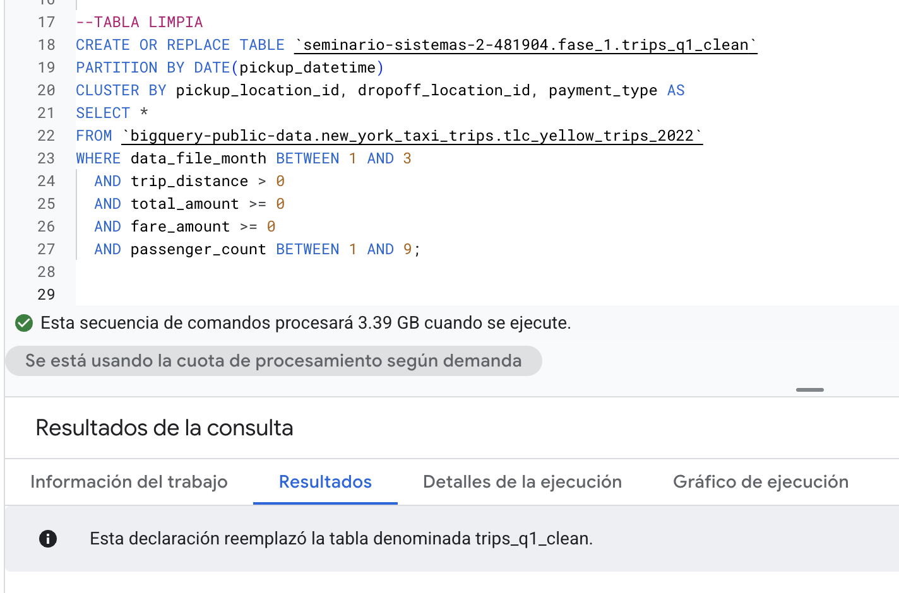
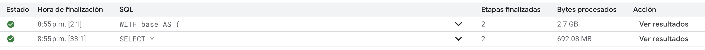
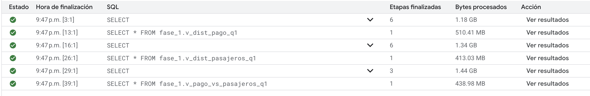
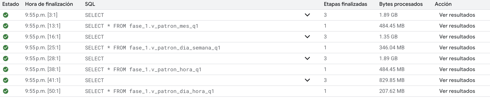

# Proyecto Fase 1 – Análisis Exploratorio de Datos Masivos en BigQuery

## Universidad de San Carlos de Guatemala  
**Facultad:** Ingeniería  
**Carrera:** Ingeniería en Ciencias y Sistemas  
**Curso:** Seminario de Sistemas 2  
**Fase:** 1  

---

- Kevin Josue Hernandez Gomez – Carnet 201020397  

---

## 2. Dataset utilizado
Se utilizó el dataset público de Google BigQuery:

**Dataset:**  
`bigquery-public-data.new_york_taxi_trips.tlc_yellow_trips_2022`

**Descripción:**  
Este dataset contiene más de 10 millones de registros correspondientes a viajes de taxi amarillo en la ciudad de Nueva York durante el año 2022. Incluye información temporal, geográfica, económica y categórica, como fechas de viaje, distancia, tarifas, propinas, método de pago y ubicaciones de origen y destino.



_Figura 1. Conexiona al dataset._
---

## 3. Transformaciones y consultas realizadas
Durante esta fase se desarrollaron consultas SQL en BigQuery para realizar un **Análisis Exploratorio de Datos (EDA)**, incluyendo:

### 3.1 Métricas descriptivas
- Distancia promedio de los viajes (`trip_distance`)
- Duración promedio de los viajes (calculada con `TIMESTAMP_DIFF`)
- Tarifas promedio (`fare_amount`)
- Propinas promedio (`tip_amount`)
- Monto total promedio (`total_amount`)
- Cálculo de medianas mediante `APPROX_QUANTILES`



_Figura 2. Metricas Descriptivas._

### 3.2 Análisis de variables categóricas
- Distribución de viajes por método de pago (`payment_type`)
- Distribución de viajes por cantidad de pasajeros (`passenger_count`)
- Comparación de montos y propinas según método de pago



_Figura 3. Distribuciones Variables._

### 3.3 Patrones temporales
- Análisis de viajes por mes
- Análisis de viajes por día de la semana
- Análisis de viajes por hora del día
- Identificación de horas pico y patrones de demanda



_Figura 4. Patrones Temprales._


Todas las consultas se encuentran documentadas y comentadas en los archivos SQL dentro de la carpeta `sql`.

---

## 4. Técnicas de optimización aplicadas
Para reducir el costo de procesamiento y mejorar el rendimiento de las consultas, se implementaron las siguientes técnicas:



_Figura 5. Creacion de Schema._

### 4.1 Tablas derivadas
Se creó una tabla derivada en el proyecto personal del equipo a partir del dataset original, seleccionando únicamente las columnas necesarias para el análisis.




_Figura 6. Creacion de subset._


### 4.2 Particionamiento
- Partición aplicada por fecha (`pickup_datetime` o `data_file_month`)
- Permite reducir el volumen de datos escaneados en consultas temporales

### 4.3 Clustering
- Clustering aplicado por:
  - `pickup_location_id`
  - `dropoff_location_id`
- Optimiza consultas que filtran o agrupan por ubicación



_Figura 7. Creacion de Particiones Y Clusterin._


### 4.4 Comparación de costos
Se documentó la diferencia de **bytes procesados antes y después** de aplicar particiones y clustering, evidenciando una reducción significativa en el costo de las consultas.

Las capturas de estas comparaciones se encuentran en la carpeta `Evidencias`.



_Figura 8. Comparacion Metricas Descriptivas._



_Figura 9. Comparacion Distribuciones Variables._



_Figura 10. Comparacion Patrones Temporales._

---

## 5. Patrones y hallazgos relevantes
Entre los principales hallazgos se identificaron:

- Mayor volumen de viajes en horarios pico (mañana y tarde)
- Diferencias claras en el monto de propinas según el método de pago
- La mayoría de los viajes corresponden a 1 o 2 pasajeros
- Variaciones mensuales y semanales en la demanda de viajes
- Relación directa entre distancia recorrida y monto total del viaje

---

## 6. Informe visual
Se desarrolló un informe visual conectado directamente a BigQuery que incluye:

- Viajes por mes
- Distribución de métodos de pago
- Promedio de tarifas por hora

🔗 **Enlace al informe visual:**  


---

## 7. Organización del repositorio

La siguiente estructura presenta la organización de los archivos y carpetas
utilizados durante el desarrollo de la **Fase 1** del proyecto.

### 📁 Estructura de carpetas

```text
Fase_1/
│
├── evidencias/
│   ├── capturas de ejecución de consultas en BigQuery
│   ├── comparación de bytes procesados antes y después de la optimización
│   └── evidencia de tablas particionadas y clusterizadas
│
├── informe/
│   ├── archivo(s) del informe visual
│   └── enlaces o documentos relacionados con Google Sheets o Looker Studio
│
├── sql/
│   ├── consultas de métricas descriptivas
│   ├── análisis de variables categóricas
│   ├── detección de patrones temporales
│   └── scripts de creación de tablas optimizadas (particiones y clustering)
│
└── README.md

